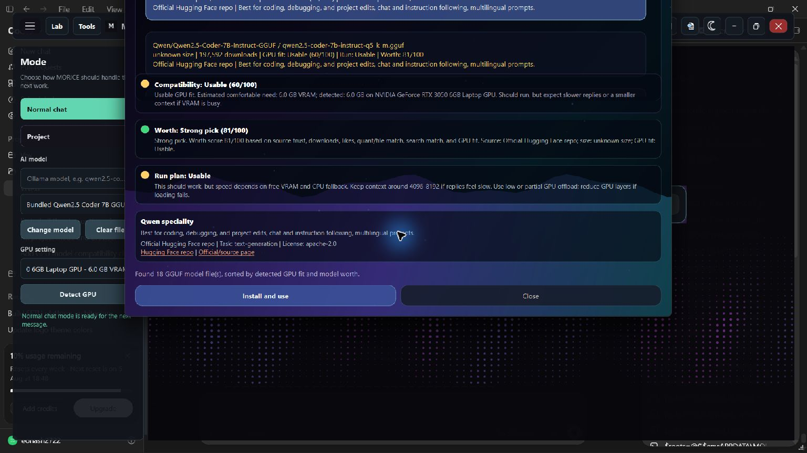

<p align="center">
  
</p>

<h1 align="center">MORICE</h1>

<p align="center">
  A local-first Windows AI workspace for conversation, deterministic visualizations,
  project building, desktop tools, and user-selected GGUF models.
</p>

<p align="center">
  
  
  
  
  
</p>

MORICE keeps the language model separate from execution and rendering. Models reason and
produce typed instructions; MORICE validates those instructions, writes approved project
files, and renders supported visual artifacts itself. A model cannot claim that a graph,
simulation, file, or project exists unless the host produced and validated it.


## What Is Included

- Local chat through the bundled Qwen2.5 Coder 7B GGUF, another GGUF selected in-app, or a local Ollama model.
- Real in-chat visualizations in Normal Chat, with progress, validation, interaction, and honest error states.
- Project Mode with a selected work folder, proposed file changes, diff review, output, tests, and explicit apply controls.
- Local-only and Online+local workflows, notes lookup, optional web context, queued follow-up messages, and conversation memory.
- GPU and VRAM detection, model compatibility estimates, trusted GGUF browsing, and model-file validation.
- Adaptive wake listening, configurable address and wake phrase, themes, fonts, accessibility settings, and workspace presets.
- Permission-controlled desktop tools, local previews, diagnostics, recovery, updates, backups, and a process-isolated plugin SDK.

## VNext Rendering

Visualization belongs to Normal Chat. Ask for a supported graph, simulation, molecule,
diagram, chart, biology model, data structure, component schematic, or local document preview.
MORICE creates a typed artifact, validates it, and replaces the progress card with a real
interactive workspace.

<table>
  <tr>
    <td width="50%"></td>
    <td width="50%"></td>
  </tr>
  <tr>
    <td align="center"><strong>Validated graph with inspection and export</strong></td>
    <td align="center"><strong>Live simulation with playback and state controls</strong></td>
  </tr>
</table>

### Verified Renderer Families

| Family | Current deterministic support |
| --- | --- |
| Graphs | Multiple functions, roots/intercepts/extrema, piecewise, polar, parametric, implicit, Mandelbrot, and linked 2D/3D surfaces |
| Physics | Particles, projectile motion, pendulum, double pendulum, springs, waves, circular/orbital motion, and Lorenz attractor |
| Chemistry | Curated molecular geometry, including benzene and supported VSEPR molecules, with shared 2D/3D atom and bond state |
| Biology | DNA, neuron, and cell models with labels, animation controls, and 2D/3D views |
| Computer science | BST, AVL, graph, linked list, queue, stack, and hash-table operations with highlights and complexity display |
| Charts | Bar, line, pie, scatter, and histogram charts from numeric prompt data |
| Diagrams | Flow, timeline, networking, OS, database, AI, security, circuit, biology, engineering, Maxwell equations, and telemetry layouts |
| Schematics | Educational component views for supported computers, cameras, vehicles, structures, machines, and electronics |
| Documents | Local text, source, Markdown, JSON, CSV, image, and PDF previews when a valid local path is supplied |
| Rich text | Markdown, tables, highlighted code, and KaTeX inline/display mathematics |

Unsupported or unparseable requests produce a visible `Visualization unavailable` result.
MORICE does not insert fake text such as `[a graph is shown]`.

See [VNext architecture](docs/vnext-science-workspace.md) for the rendering contract and
current limitations.

## Project Mode

Project Mode turns a prompt into reviewed workspace changes instead of a copy-paste answer.

1. Select or create a work folder with `+`.
2. Choose `Limited to folder` or `Full access`.
3. Choose `Local` or `Online+local` context.
4. Ask MORICE to build or modify the project in the language and framework you want.
5. Review the proposed files and green/red diff.
6. Apply or reject the exact change set, then run the generated project and tests.

`Limited to folder` confines file operations to the selected root. `Full access` expands the
available workspace but does not remove validation, protected-path checks, or explicit approval
for sensitive operations.

## Model Manager

The renderer pipeline is model-agnostic. Changing the model changes language and coding quality;
it does not let a model bypass artifact validation or file permissions.

<table>
  <tr>
    <td width="50%"></td>
    <td width="50%"></td>
  </tr>
</table>

### Bundled Model VRAM Guide

The official package uses a Qwen2.5 Coder 7B Q4 GGUF. Actual use depends on context length,
GPU layers, driver overhead, and other applications using VRAM.

| Dedicated VRAM | Expected run plan |
| ---: | --- |
| 0-3 GB | CPU-first or very small partial offload; usable but slow; 12-16 GB system RAM recommended |
| 4 GB | Partial GPU offload with a conservative context; close background GPU applications |
| 6 GB | Recommended balanced lane for the bundled model; near-full/full offload depends on context and runtime overhead |
| 8 GB | Comfortable full-offload target with more context headroom |
| 12 GB+ | Strong headroom for longer contexts or a larger replacement model |

Use `Panel > Change model` to select another valid GGUF or local Ollama model that fits your
hardware. MORICE rejects files that do not pass model-format validation.

## Installation

### Official Installer

Download `MORICE-Setup-0.7.0-vnext.exe` and every numbered `.bin` slice shown beside it in the
same release. Keep those files together, then run the Setup executable. The installer is per-user
and does not require administrator access.

### Portable ZIP

Download every `MORICE-0.7.0-vnext-portable.zip.part*` file, the matching `.parts.json` manifest,
and `MORICE-0.7.0-vnext-portable-reassemble.ps1` into one folder. Run the reassembler, extract the
verified ZIP it creates, and launch `MORICE.exe`. The split is required only because the complete
portable ZIP is larger than GitHub's per-file release limit. The archive contains runtime files only;
it excludes source caches, virtual environments, editor state, build logs, and development notes.

Verify downloads against `checksums.json` from the same release.

## Run From Source

```powershell
git clone https://github.com/EONASH2722/MORICE.git
cd MORICE
py -3.12 -m venv .venv
.\.venv\Scripts\Activate.ps1
python -m pip install -r requirements.txt
python morice_app_launcher.py
```

The repository does not track the large GGUF or llama runtime binaries. Put a valid model at the
path shown by the app, use Ollama, or choose a model through `Panel > Change model`.

## Verification

```powershell
python -m unittest discover -s tests
cd vnext
pnpm test
pnpm run typecheck
```

The release script runs those checks before building PyInstaller, the split portable Zip64 package,
the Inno Setup installer, and SHA-256 metadata:

```powershell
powershell -ExecutionPolicy Bypass -File scripts\build-release.ps1
```

## Documentation

- [User manual](docs/user-manual.md)
- [VNext rendering architecture](docs/vnext-science-workspace.md)
- [Desktop and agent architecture](docs/architecture.md)
- [Troubleshooting](docs/troubleshooting.md)
- [Release notes](docs/release-notes-0.7.0-vnext.md)
- [Contributing](CONTRIBUTING.md)
- [Security policy](SECURITY.md)
- [Changelog](CHANGELOG.md)

## Privacy And Safety

Normal local chat, selected GGUF inference, notes search, project files, and deterministic
renderers can remain on the machine. Online lookup is explicit. MORICE validates renderer data,
confines folder-limited project operations, protects application paths, and asks for approval for
sensitive desktop or Git mutations. Review every proposed change before applying it.

## License

MORICE is available under the [MIT License](LICENSE).
