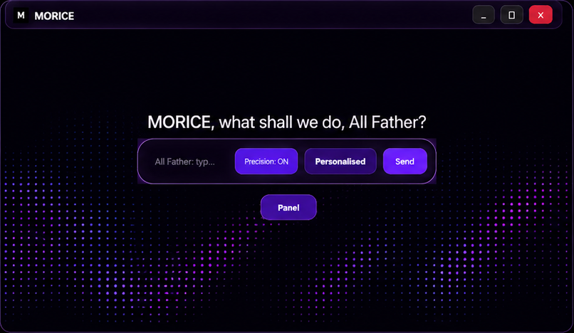
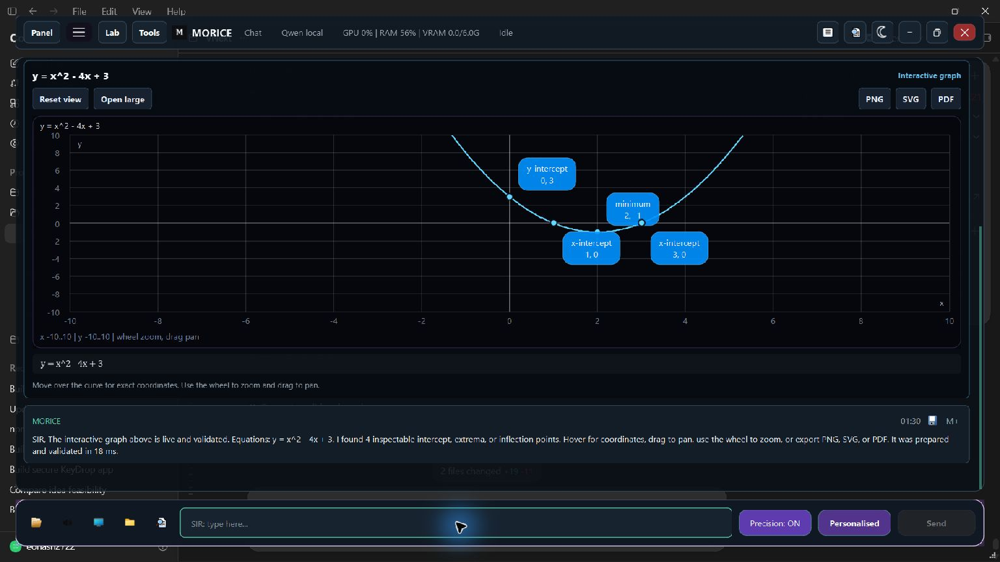
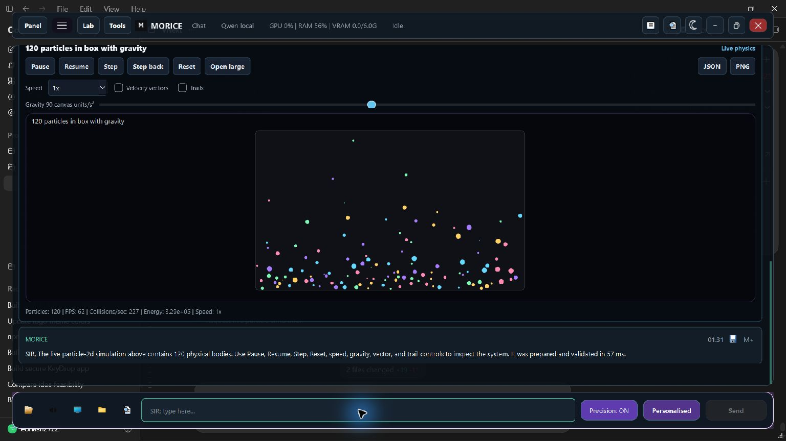
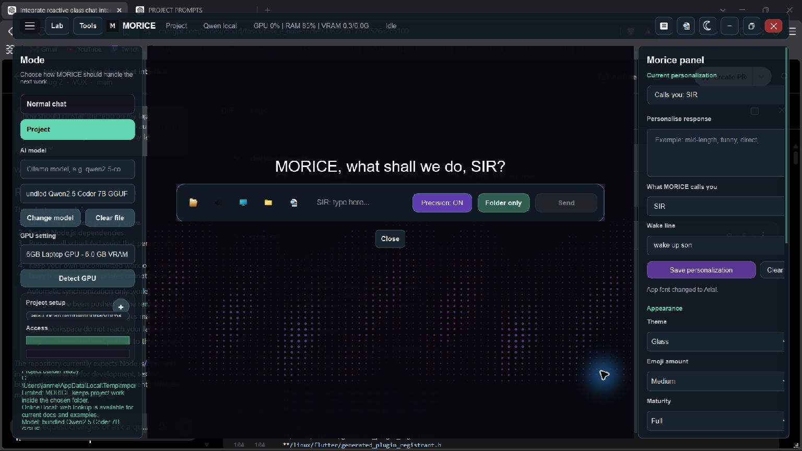
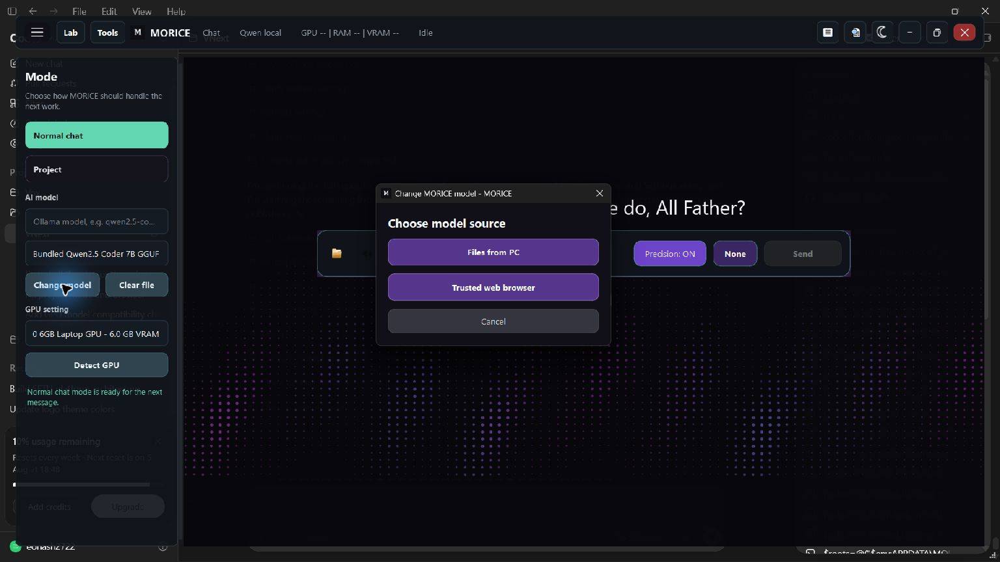
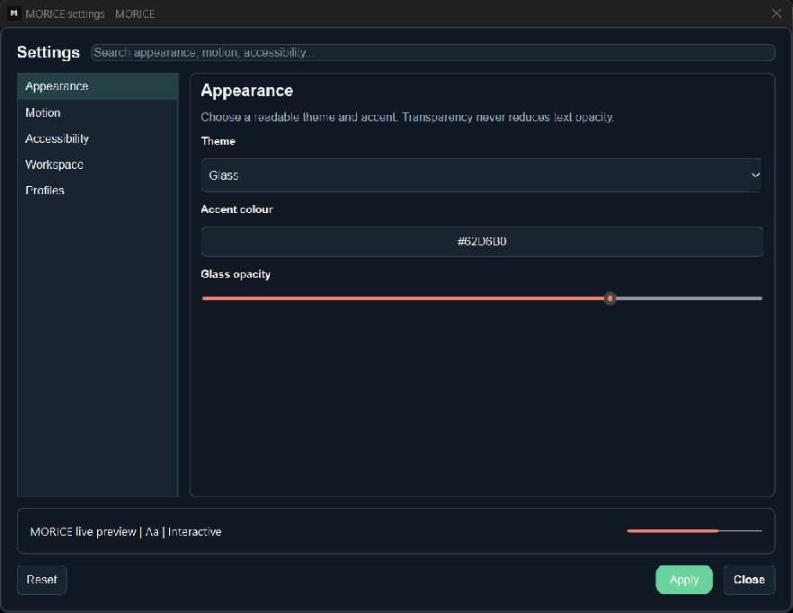

<p align="center">
  <a href="https://eonash2722.github.io/MORICE/" title="Open the MORICE website">
    
  </a>
</p>

<h1 align="center">MORICE</h1>

<p align="center">
  <strong>A local-first Windows AI workspace for conversation, Live Action, real visualizations, project building, and desktop assistance.</strong>
</p>

<p align="center">
  <a href="https://eonash2722.github.io/MORICE/"><strong>Website</strong></a> ·
  <a href="docs/README.md">Documentation</a> ·
  <a href="https://github.com/EONASH2722/MORICE/releases/latest">Releases</a>
</p>

<p align="center">
  <a href="https://github.com/EONASH2722/MORICE/releases/latest"></a>
  
  
  
  
  <a href="LICENSE"></a>
</p>

MORICE combines local model inference with a desktop workspace that can answer questions, build projects, operate permission-aware tools, and mount validated interactive artifacts directly in chat. Language models provide reasoning and structured proposals; MORICE validates and executes the result through its own renderers, project engine, and desktop services.



## Highlights

- **Local model support:** use a GGUF model through the bundled llama runtime or connect to a local Ollama model.
- **Conversation memory:** contextual follow-ups can reference earlier messages, saved preferences, selected notes, and the active workspace.
- **Real visualizations:** interactive graphs, simulations, molecules, biology models, data structures, charts, diagrams, schematics, and file previews render inside Normal Chat and Live Action.
- **Project Mode:** turn a prompt into validated files and diffs inside a chosen work folder; folder-limited mode stages review while Full access applies routine project writes atomically.
- **General project workflows:** detect Unity, Unreal, Roblox, Godot, Visual Studio/.NET, Android, Node, Python, Java, Rust, Go, and web markers; run available declared builds/tests and retain exact evidence.
- **Desktop assistance:** permission-aware file search, system information, clipboard actions, media controls, workspace tools, tasks, notes, and diagnostics.
- **Live Action:** a separate camera-centered voice workspace that retains Chat, Lab, Tools, graphs, attachments, desktop control, and Project builds; camera access is explicit and exiting stops camera, STT, TTS, and visual work.
- **Automatic context:** relevant local notes are selected without special commands; freshness-sensitive questions use source-linked web context when online and fall back locally when offline.
- **Local background wake:** the packaged listener recognizes MORICE, configured magic words, or a double-clap, releases the microphone while Live Action owns it, and opens without stealing foreground focus.
- **Adaptive execution:** goal state, capability discovery, device context, network/Bluetooth observation, and platform adapters keep execution grounded in verified host abilities.
- **Model manager:** inspect detected GPU/VRAM, compare run plans, validate GGUF files, and switch models without editing configuration files.
- **Extensible platform:** isolated plugins, permission manifests, renderer contributions, lifecycle controls, diagnostics, and package validation.
- **Recovery and updates:** bounded workspace state, backups, verified update staging, rollback protection, activity history, and resumable tasks.
- **Personalization:** name and wake-line preferences, dark/light themes, custom fonts, emoji amount, response maturity, motion, opacity, contrast, and text sizing.
- **Android companion:** unified chat, opt-in voice, on-demand Live Vision, and encrypted device-scoped PC/phone tasks without copying desktop Project Mode onto the phone.

## Interactive Rendering

MORICE never treats prose such as `[a graph appears]` as a successful render. Every completed visual artifact is parsed, typed, rendered, and validated by the host application. Unsupported input receives a visible failure state instead of an imaginary result.

<table>
  <tr>
    <td width="50%"></td>
    <td width="50%"></td>
  </tr>
  <tr>
    <td align="center"><strong>Graphs</strong><br>Pan, zoom, inspect, reset, and export</td>
    <td align="center"><strong>Simulations</strong><br>Playback, time controls, replay, and state export</td>
  </tr>
</table>

### Available renderer families

| Family | Current scope |
| --- | --- |
| Mathematics | Cartesian, piecewise, polar, parametric and implicit graphs, linked 2D/3D surfaces, and Mandelbrot views |
| Physics | Particles, projectile motion, pendulums, springs, waves, circular/orbital motion, and Lorenz attractors |
| Chemistry | Supported molecular structures and VSEPR geometries with shared 2D/3D atom and bond state |
| Biology | DNA, neuron, and cell models with labels and switchable 2D/3D views |
| Computer science | BST, AVL, graph, linked list, queue, stack, and hash-table operations with complexity displays |
| Data and diagrams | Bar, line, pie, scatter and histogram charts plus structured flows, timelines, networks, circuits, UML, and domain diagrams |
| Files | Inline previews for local text, source, Markdown, JSON, CSV, images, and PDFs |

The [feature matrix](docs/feature-matrix.md) contains the exact supported inputs and limitations.

## Agent And Tool Runtime

MORICE includes a host-managed agent pipeline rather than sending every request through one undifferentiated prompt.

- Intent routing and ordered multi-task decomposition.
- Context selection, history compression, project indexing, and model health tracking.
- Specialized conversation, coding, research, visualization, and desktop workflows.
- Explicit permission grants for sensitive tools and workspace mutations.
- Patch previews, stale-file protection, transactional apply, and verified undo.
- Background task progress, cancellation, retry, activity history, and recovery.
- Honest completion rules: a tool, render, or project task cannot report success without a validated result.

## Project Mode

Project Mode is a development workspace for generating and editing real files.

1. Select or create a work folder.
2. Choose folder-limited or broader access.
3. Choose local or online-plus-local context.
4. Describe the application, game, website, language, framework, and constraints.
5. Review the proposed project tree and red/green diffs.
6. Inspect command output, tests, errors, and Git status.
7. Apply, reject, continue, or undo the validated change set.

The process panel preserves an expandable observed-action trace after completion. It shows selected
routes, detected tools, files written, commands executed, and verification results—not private
model chain-of-thought. MORICE reports file, build, test, editor, and playtest status separately.

## Live Action

Choose **Mode > Live Action**, or use the speaker button beside the composer, to enter and wake the camera-centered workspace; no second wake phrase is required. Live Action uses offline Vosk speech-to-text for user turns and interruptible ElevenLabs streaming speech for MORICE replies. Its live transcript, glass response overlay, and typed composer retain attachments, graphs, Lab, Tools, desktop actions, and project-building. The camera remains off until explicitly enabled, frames stay in memory, and visual inference runs on demand rather than on every preview frame.

Choose **Normal Chat** or **Project**, press the active speaker button again, or use **Exit Live Action** to exit. MORICE immediately stops the camera, cancels microphone capture, reply playback, and vision inference, clears temporary frames/visual memory, and ignores late callbacks. The installed build starts a lightweight local wake listener with Windows so MORICE can respond to its name, configured magic words, or a double-clap while the main window is closed. It does not activate the camera and releases the microphone whenever Live Action is already listening. Set `MORICE_ENABLE_ALWAYS_ON_WAKE=0` or disable **MORICE Wake Listener** in Windows Startup Apps to turn it off.



MORICE can work with text-based languages supported by the selected model and installed toolchain. See the [Project Mode guide](docs/project-mode.md) for access boundaries and workflow details.

## Models And Hardware

The model browser detects available GPU memory and presents a practical run plan before a model is selected.

| Dedicated VRAM | Starting point for the release model |
| ---: | --- |
| 0-3 GB | CPU-first or small partial offload; use sufficient system RAM |
| 4 GB | Conservative context and partial GPU offload |
| 6 GB | Recommended balanced configuration |
| 8 GB | Comfortable offload with additional context headroom |
| 12 GB+ | Headroom for longer contexts or a larger replacement model |

Actual performance depends on quantization, context length, GPU layers, drivers, system RAM, and other workloads. Use **Panel > Change model** to choose a GGUF or local Ollama model that fits the machine.

<table>
  <tr>
    <td width="50%"></td>
    <td width="50%"></td>
  </tr>
  <tr>
    <td align="center"><strong>Model manager</strong><br>Hardware-aware model selection</td>
    <td align="center"><strong>Settings</strong><br>Appearance, voice, behavior, and accessibility</td>
  </tr>
</table>

## Install

Download the newest verified build from [GitHub Releases](https://github.com/EONASH2722/MORICE/releases/latest).

### Windows installer

Download the setup executable and every adjacent numbered `.bin` slice into one folder, then run the setup executable. Installation is per-user and includes a Start menu shortcut with an optional desktop shortcut.

### Portable build

Download all portable `.part*` files, the `.parts.json` manifest, and the matching reassembly script from the [MORICE Portable Plug-and-Play Release](https://github.com/EONASH2722/MORICE/releases/tag/v0.8.0-portable) into one folder. Run the script from PowerShell, extract the verified ZIP, and launch `MORICE.exe` without separating it from `_internal`.

### Android companion

Download the signed APK from the [MORICE Android Release](https://github.com/EONASH2722/MORICE/releases/tag/v0.8.0-android), verify its SHA-256 manifest, install it on Android 9 or newer, then pair it through **Panel > Pair a device** on MORICE Desktop. See the [Android companion guide](docs/android-companion.md).

### Python package

Advanced users can install the model-free wheel included with the release:

```powershell
python -m pip install .\morice_ai-0.8.0-py3-none-any.whl
morice
```

Select a local GGUF or Ollama model after launch. Verify every downloaded asset with `SHA256SUMS.txt` or `checksums.json`.

## Run From Source

```powershell
git clone https://github.com/EONASH2722/MORICE.git
cd MORICE
py -3.12 -m venv .venv
.\.venv\Scripts\Activate.ps1
python -m pip install -r requirements.txt
python morice_app_launcher.py
```

## Verify

```powershell
python -m unittest discover -s tests
cd vnext
pnpm test
pnpm run typecheck
```

Build all release assets with:

```powershell
powershell -ExecutionPolicy Bypass -File scripts\build-release.ps1
```

The release pipeline produces the Windows installer, portable package, source and documentation archives, Python wheel and source distribution, package-content audit, and SHA-256 manifests.

## Documentation

- [User manual](docs/user-manual.md)
- [Feature matrix](docs/feature-matrix.md)
- [Project Mode](docs/project-mode.md)
- [Android companion](docs/android-companion.md)
- [VNext rendering](docs/vnext-science-workspace.md)
- [Models and performance](docs/model-guide.md)
- [Advanced configuration](docs/advanced-configuration.md)
- [Architecture](docs/architecture.md)
- [Plugin SDK](docs/plugin-sdk.md)
- [Developer guide](docs/developer-guide.md)
- [Troubleshooting](docs/troubleshooting.md)

## Contributing And Security

Read [CONTRIBUTING.md](CONTRIBUTING.md) before opening a pull request. Report security problems privately through the process in [SECURITY.md](SECURITY.md).

MORICE keeps folder boundaries, protected paths, renderer validation, plugin isolation, and sensitive-action confirmations active even when broader Project Mode access is selected.

## License

MORICE is released under the [MIT License](LICENSE).
