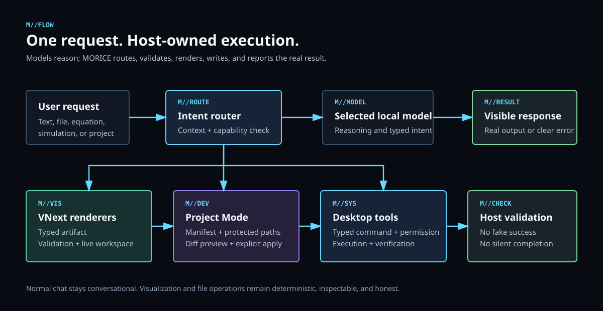

<p align="center">
  
</p>

# MORICE

MORICE is a local desktop AI workspace for people who want an assistant that can talk, research, read notes, build files, plot equations, and run deterministic physics demos without losing the feel of a personal tool. It combines a PySide6 glass interface, offline GGUF/Ollama model support, trusted model browsing, notes lookup, optional web lookup, wake control, queued follow-up messages, Project mode file building, and an early VNext science workspace.

<p align="center">
  
  
  
  
  
  
  
</p>

<p align="center">
  
</p>

## Workflow Map

The main MORICE modes all pass through the same intent layer, then branch into the right context source before the local model replies or applies files.

<p align="center">
  
</p>

## VNext Science Workspace

MORICE now has the first desktop slice of a scientific workspace. Chat stays clean: when a graph or simulation is generated, chat shows a small clickable preview card and the actual visualization opens in the `Lab` workspace dock beside the conversation.

Current VNext desktop slice:

- Deterministic Graph Engine in `morice/science_engine.py`.
- Interactive PySide graph canvas with dark grid, zoom, pan, multiple equations, x/y-intercept callouts, extrema callouts, and point inspection.
- Graph prompts can cover standard `y = ...` functions, multiple equations, polar `r = ...` curves, and parametric `x(t), y(t)` curves in the current desktop slice.
- 2D particle/projectile physics canvas with gravity, bounds, collisions, pause/resume, stepping, and speed control.
- Model-agnostic instruction shape: `simulationType`, `equations`, and `parameters`.
- Lab workspace dock with `Graphs`, `Simulations`, and `Notebook` tabs.
- Chat preview cards that open the right workspace view instead of rendering graphs inside chat.
- Notebook tab stores artifact metadata and the deterministic instruction JSON for future persistent project sessions.

Planned VNext engine expansion:

- Plotly plus a MathJS-powered parser for the production web renderer.
- Matter.js/Planck.js for richer 2D physics.
- Three.js plus Rapier/Cannon-es for GPU-accelerated 3D rigid-body scenes.
- Export to PNG, SVG, GIF, MP4, and JSON state.
- Persistent per-project graph, simulation, file, memory, and notebook artifacts.

See `docs/vnext-science-workspace.md` and the strict TypeScript scaffold in `vnext/` for the planned engine layer.

## Highlights

- Glass desktop interface with a centered launch composer, animated galaxy/wave surfaces, and a Send button that stays calm instead of using a liquid-fill animation.
- Local-first model routing through a bundled GGUF, a selected GGUF file, or an installed Ollama model.
- Trusted model browser with automatic GPU/VRAM detection, one-click trusted model lanes, compatibility scoring, worth scoring, official-source links, licenses, task metadata, and model-speciality summaries.
- Project mode that reads a bounded snapshot of a selected work folder, asks the model for a strict file manifest, applies safe file writes, rescues filename-labeled markdown code blocks into editable files, falls back to a local builder when the model does not return usable project output, remembers retry requests, and shows a right-side diff panel.
- VNext Lab workspace for graphing equations and running deterministic 2D physics previews beside chat.
- `@web` lookup for fresh information when needed, with results passed into the local reply pipeline instead of leaving the whole chat online by default.
- `@notes` lookup for local knowledge files, so MORICE can answer from personal documents without uploading them.
- Wake listener that can launch or wake MORICE by saved phrase or clap pattern.
- Message queue for follow-up steering while a long local reply is still generating.
- Personalization panel for the user title, wake phrase, and preferred response style.
- Typo-aware and short-form-aware intent handling, so rough wording can still land in the right workflow.
- MIT licensed, so the project can be studied, forked, customized, and improved.

## Quick Install

Ready PC app:

```powershell
powershell -ExecutionPolicy Bypass -Command "Invoke-WebRequest https://raw.githubusercontent.com/EONASH2722/MORICE/main/scripts/install-pc-app.ps1 -OutFile install-pc-app.ps1; .\install-pc-app.ps1"
```

This downloads the MORICE PC release package, verifies it, and extracts it to your user folder.

Requirements:

- Windows 10/11
- Python 3.12
- Git
- A GGUF model file, or any Ollama model name installed on your machine
- Optional: a Vosk English model for wake-word recognition

Clone the repo:

```bat
git clone https://github.com/EONASH2722/MORICE.git
cd MORICE
```

Create a virtual environment:

```bat
py -3.12 -m venv .venv
.venv\Scripts\activate
python -m pip install --upgrade pip
python -m pip install -r requirements.txt
```

Install the local model:

```powershell
powershell -ExecutionPolicy Bypass -File scripts\install-model.ps1
```

The installer places this file in the repo root:

```text
qwen2.5-coder-7b-instruct-q4_k_m.gguf
```

The script tries the MORICE GitHub model release first, then falls back to the public Hugging Face GGUF if the release asset is not available yet. You can also set:

```bat
set MORICE_GGUF_PATH=D:\Models\your-model.gguf
```

Run MORICE:

```bat
python -m morice.pyside_app
```

## Packaged App

Build the Windows app:

```bat
py -3.12 -m PyInstaller -y MORICE.spec
```

Run the packaged build:

```bat
dist\MORICE\MORICE.exe
```

## Model Distribution

The packaged build prefers the local Qwen model you selected. This workspace package uses:

```text
Qwen2.5-Coder-7B-Instruct-abliterated-Q4_K_M.gguf
```

The normal open-source installer downloads the official compatible Qwen file named `qwen2.5-coder-7b-instruct-q4_k_m.gguf`; MORICE will use either file. Models are not committed into normal Git history because GitHub blocks normal files above 100 MiB. Use:

```powershell
powershell -ExecutionPolicy Bypass -File scripts\install-model.ps1
```

Maintainers can prepare split GitHub Release assets with:

```powershell
powershell -ExecutionPolicy Bypass -File scripts\prepare-model-release.ps1
```

Upload every generated file from `release\model-qwen2.5-coder-7b-instruct-q4-k-m` to this release tag:

```text
model-qwen2.5-coder-7b-instruct-q4-k-m
```

The model release is available here:

```text
https://github.com/EONASH2722/MORICE/releases/tag/model-qwen2.5-coder-7b-instruct-q4-k-m
```

`install-model.ps1` installs the model directly from that MORICE GitHub release.

## Qwen2.5 Coder 7B VRAM Guide

These are practical targets for the base Qwen2.5 Coder 7B Q4_K_M model. The packaged desktop build uses the selected local Qwen GGUF; the installer downloads the official Qwen Q4_K_M file. Exact speed depends on your CPU, GPU, driver, context length, and how many layers you offload.

| VRAM level | Recommended setup | What to expect |
| --- | --- | --- |
| 0-4 GB | CPU mode or very low GPU layers | Runs offline, but slower replies are normal. |
| 6 GB | Q4_K_M with a small/medium context | Usable for chat and light project mode if other apps are not eating VRAM. |
| 8 GB | Q4_K_M with more GPU offload | Good default level for MORICE's base AI. |
| 10-12 GB | Q4_K_M/Q5 with larger context | Smoother project work, longer files, and better multitasking. |
| 16 GB | Higher context and heavier offload | Comfortable for larger code snapshots and longer replies. |
| 24 GB+ | Larger models or multiple local tools | Room to experiment with stronger models while keeping MORICE responsive. |

Tip: if your PC struggles, lower `MORICE_GPU_LAYERS`, lower `MORICE_CTX`, or use the in-app `Change model` feature to pick a lighter GGUF/Ollama model that fits your VRAM limit.

## Model Control

Open the mode panel with the RGB three-line button, then use the `AI model` section.

MORICE supports four practical model routes:

- Type an Ollama model name, for example `qwen2.5-coder:7b`, `deepseek-r1:1.5b`, or your own custom Ollama model.
- Use `Change model` -> `Files` to pick a file from your PC. The picker accepts any file, then MORICE verifies whether it is an AI model. GGUF files can be used directly by this desktop app.
- Use `Detect GPU` to save your GPU and VRAM profile for model-fit checks.
- Use `Change model` -> `Web` to open MORICE's custom liquid-galaxy model browser. It searches trusted Hugging Face GGUF sources and official model pages, auto-detects GPU/VRAM, preloads a best-fit lane, skips split GGUF shards that cannot install as one file, sorts results by detected GPU fit plus model worth, shows each model's speciality/source/license/task details, and displays compatibility, worth, and a run plan before install.
- The run plan tells the user whether the model is recommended, balanced, usable, CPU-assisted, or not recommended on the detected GPU, plus context and GPU-offload guidance.

MORICE validates selected files before saving them. Random files are rejected with a clear error. This desktop build can run GGUF models directly through the bundled llama runner. If a GGUF file is selected, it takes priority. Use `Clear file` to let the typed Ollama model name answer instead.

After a model change, MORICE resets the local GGUF runtime/cache so the next reply loads the newly selected model cleanly. The selected GGUF path, typed Ollama model name, and detected GPU profile are saved in MORICE settings and used on the next reply/model search.

## PC App Release

The packaged Windows app lives in:

```text
dist\MORICE\MORICE.exe
```

For GitHub releases, the app can be uploaded as a split ZIP package, like a PC app bundle:

```powershell
powershell -ExecutionPolicy Bypass -File scripts\prepare-pc-release.ps1
```

Upload every generated file from `release\morice-pc-app` to a GitHub release. Users who want the ready app can download the release package; developers can still clone the repo and install manually.

Once the release assets are uploaded, users can install the ready PC app with:

```powershell
powershell -ExecutionPolicy Bypass -File scripts\install-pc-app.ps1
```

The PC app release is available here:

```text
https://github.com/EONASH2722/MORICE/releases/tag/morice-pc-app
```

Manual users can download `pc-app-manifest.json` and all `MORICE-PC.zip.part*` files from that release, join the parts in order into `MORICE-PC.zip`, then extract it.

## Wake Listener

Start the always-listening wake process:

```bat
start-wake-listener.bat
```

Wake behavior:

- Say the saved wake line, for example `wake up son`.
- Or clap twice inside the wake window.
- Either path launches the app if needed and sets MORICE awake automatically.
- The listener has a wake cooldown so repeated partial voice matches or extra claps do not spam MORICE.
- It detects both the packaged `MORICE.exe` app and manual Python runs, so it avoids launching duplicates during development.

The wake line can be changed in the MORICE panel.

Wake diagnostics:

```bat
python morice_wake_listener.py --self-test
python morice_wake_listener.py --list-devices
```

To force a specific microphone, set `MORICE_AUDIO_DEVICE` to the device index or device name before starting the listener.

Optional startup install:

```powershell
powershell -ExecutionPolicy Bypass -File install-wake-listener-startup.ps1
```

## Response Style

MORICE is tuned for answers that feel useful without becoming robotic:

- Start with the direct answer.
- Use short headings when structure helps.
- Explain the reason, tradeoff, or next step in plain language.
- Include examples, checks, or commands when they move the task forward.
- Keep personality present, but keep the work clear.

If you want shorter answers, add a style in the panel such as:

```text
short, direct, no extra explanation
```

## Personalization

Open `Panel` to change:

- What MORICE calls you. Default: `All Father`.
- The wake line.
- The reply style.

The chosen name updates the launch prompt, input placeholder, start/wake messages, and how MORICE addresses you in replies.

## Modes

Use the RGB three-line button on the left side of the title bar to open the mode panel:

- `Normal chat` for everyday questions and casual use.
- `Project` for building apps, games, websites, tools, scripts, APIs, and mobile app plans.

Project mode is designed for real workspace changes:

- A Project-only setup area that appears after clicking `Project`.
- A `+` button for choosing or creating a work folder outside the MORICE app folder.
- `Limited to folder`, which keeps project paths and commands inside the chosen folder and asks permission for any specific job outside it.
- `Full access`, which treats normal requested project work as pre-approved while staying private, safe, and non-destructive.
- File building: describe the app, game, website, script, or tool you want, and MORICE writes the project files into the selected work folder.
- If no folder is selected, MORICE prepares a safe default work folder outside the app at `~/MORICE Projects/Quick Build`.
- Existing project awareness: MORICE reads a bounded snapshot of the work folder before editing, so it can update files instead of replacing blindly.
- Local fallback building: if the selected model answers normally instead of returning a safe JSON file manifest, MORICE can still generate a practical starter project for common web, game, script, and tool requests.
- A right-side `Project changes` panel that shows unified diffs with green additions and red removals after each file-building action.
- `Local mode` uses the selected folder and local model only.
- `Online+local` can add web context for current libraries, docs, patterns, and examples.
- Stronger coding behavior for any requested language or framework.
- Typo-aware intent handling, so rough wording is interpreted from chat context.
- Safer build detection, so `chat:`, `ask:`, `question:`, and `explain:` prompts stay as conversation instead of being treated as file writes.
- In Project mode, the composer replaces the `Personalised` button with the current access mode and adds the local/online toggle.
- The Send button stays grey when empty or while MORICE is replying, then switches to a clean ready state when text can be sent.

## Graphs And Simulations

Use natural prompts:

```text
plot y=x^2-4x+3
plot y=sin(x) and y=cos(x)
simulate projectile motion
simulate 300 particles with gravity and collisions
```

MORICE routes these to deterministic engines:

```text
chat prompt -> science intent -> instruction JSON -> graph/physics engine -> Lab workspace
```

The AI model may help reason about the problem, but rendering stays deterministic. The model does not draw directly; the app turns supported instructions into graph data or simulation state.

## Message Queue

When MORICE is generating, the send button becomes `Steer`.

Type a follow-up and press Enter or click `Steer`; it is added to the queue. Open `Panel` to:

- Move queued messages up or down.
- Remove one queued message.
- Clear the whole queue.

MORICE sends the next queued item automatically as soon as the current reply arrives.

## Web Lookup Chain

Use:

```text
@web your search query
```

`web:` also works. Normal chat stays offline unless a message starts with `@web` or `web:`.

In Project mode, `Online+local` can search automatically for project context. Switch the composer toggle to `Local mode` when you want file/folder-only work.

The chain is:

```text
@web prompt -> web search -> compact source context -> local model -> answer with source URLs
```

## Notes Chain

Default notes folder:

```text
D:\FOOD FOR MORICE
```

Use `@notes` in a message to include local notes.

The chain is:

```text
@notes prompt -> local notes search -> relevant snippets -> local model -> grounded answer
```

## Useful Commands

- `wake up son`
- `precision on` / `precision off`
- `math steps on` / `math steps off`
- `@web <query>`
- `@notes <question>`

## Customize MORICE

Common places to edit:

- UI and animations: `morice/pyside_app.py`
- MORICE personality and reply rules: `morice/core.py`
- Graph and physics instruction engine: `morice/science_engine.py`
- Local model routing and token budget: `morice/llm_client.py`
- Project fallback file builder: `morice/project_builder.py`
- Model verification/search/VRAM scoring: `morice/model_catalog.py`
- Wake listener sensitivity and magic words: `morice_wake_listener.py`
- Saved personalization settings: `morice/settings.py`
- Logo and queue screenshot: `morice/assets/` and `docs/screenshots/`
- Build bundle: `MORICE.spec`
- Future TypeScript graph/physics architecture: `vnext/`

Useful environment variables:

- `MORICE_GGUF_PATH` sets a specific GGUF path.
- `MORICE_MODEL` sets an Ollama model name and bypasses the GGUF default.
- `MORICE_MAX_TOKENS` controls reply length. Default: `4096`.
- `MORICE_LLAMA_SERVER` set to `1` to use bundled llama-server.
- `MORICE_CTX` sets context length.
- `MORICE_GPU_LAYERS` sets GPU layers.
- `MORICE_THREADS` sets CPU threads.
- `MORICE_BATCH` sets batch size.
- `MORICE_WEB` set to `0` to disable web lookup.

## Project Layout

```text
morice/
  pyside_app.py        Desktop UI
  project_builder.py   Local Project mode fallback file generator
  science_engine.py    Deterministic graph and physics artifact generator
  core.py              Personality, commands, and helper replies
  llm_client.py        Local/Ollama model routing
  model_catalog.py     Trusted model search, GPU fit scoring, and file verification
  settings.py          Personalization, model choice, wake-line, and GPU profile storage
  web_search.py        Optional web lookup pipeline
  assets/              Logo and bundled app assets
docs/screenshots/      Queue-system README screenshot
docs/vnext-science-workspace.md
scripts/               Model install and release-prep scripts
vnext/                 Strict TypeScript future graph/physics engine scaffold
morice_wake_listener.py
MORICE.spec
Modelfile
```

## Contribute

MORICE is open source under the MIT license. Fork it, change it, and make it yours. Small focused pull requests are easiest to review:

- Describe what changed.
- Mention how you tested it.
- Keep large model files out of Git.
- Do not commit `node_modules`, voice model folders, logs, or private memory files.

See [CONTRIBUTING.md](CONTRIBUTING.md) for the development checklist.

## Change The Model To Anything

The base AI is Qwen2.5 Coder 7B, but MORICE is not locked to one brain. Open the mode panel, type any installed Ollama model name, pick a local GGUF with `Change model` -> `Files`, or install one through `Change model` -> `Web`. MORICE saves that choice and uses it on the next reply, so builders can change the model without editing code. Hermes is retained only as an optional comparison/test model.

## License

Code: MIT. Models: follow the license for the GGUF model or Ollama model you use.
