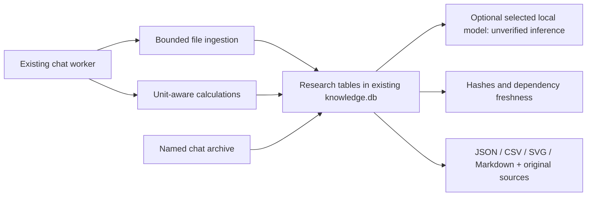

# Scientific research core — source preview

This is a tested foundation for the original Universal Scientific Research Core
brief, **not completion of that entire specification**. Older public `0.8.0`
downloads do not necessarily contain this preview. Install current source with
`python -m pip install -e ".[research]"`; release builders use `.[dev,research]`.

## Use it in normal chat

Wake MORICE first if it is asleep. There is no separate research mode.

1. Attach a text PDF, DOCX, CSV, TSV, XLSX, JSON, XML, notebook, or text document.
   Multiple files can be selected together (maximum 20 per request).
2. Ask, for example, `Research this experiment and analyze this dataset`.
3. MORICE creates a persistent project, hashes the evidence, profiles tables,
   and reports missing values, duplicate rows, nonfinite numbers, numeric
   statistics, and IQR outlier flags. These are descriptive checks, not causal
   inference or hypothesis tests.
4. `Continue research` uses the active project. `New research: <objective>` creates
   a new one. `List research projects` shows up to 100 recent projects;
   `Resume research <project-id>` attaches an existing project to the current chat.
5. `Export research` creates a uniquely named folder under the runtime's
   `research/exports` directory and reports its actual path.

An installed, selected GGUF/Ollama model may add an **INFERRED, unverified**
interpretation. Model errors are recorded as failures, never scientific results.
The deterministic file/calculation path does not need a model or network.

## Reproducible calculations

Supply explicit inputs and an expression in a fenced block. MORICE does not yet
reliably translate arbitrary scientific prose into a verified computation.

````text
Calculate this kinetic energy:
```calculation
{
  "expression": "0.5*m*v**2",
  "inputs": {
    "m": {"value": 2, "unit": "kg"},
    "v": {"value": 3, "unit": "m/s"}
  },
  "output_unit": "J"
}
```
````

This produces 9 joules using Pint dimensional quantities. Add
`"sweep": {"parameter": "v", "values": [1, 2, 3]}` to calculate 1, 4, and 9 J.
The bounded expression parser permits arithmetic and named inputs, not Python
calls, imports, arbitrary scripts, or document macros. A sweep is limited to
1,000 values. Incompatible units fail visibly.

## Evidence and persistence



Records have stable IDs, provenance, timestamps, and project-local relationships.
The store supports hypotheses, assumptions, constraints, parameters, failures,
observations, calculations, and artifacts. Hypothesis state changes and parameter
revisions are currently a **Python store API**, not a full visual research editor.
Revising an input marks transitive dependent records stale; it does not silently
recompute them. A calculation only has graph dependencies when its caller supplies
them; the chat calculation block currently records inline inputs, not linked
parameter records.

Provenance labels include USER_DATA, CITED, CALCULATED, SIMULATED, MEASURED,
INFERRED, ESTIMATED, HYPOTHESIS, and UNKNOWN. They identify the asserted origin;
they are not proof that the source or methodology is correct. CITED requires a
stored source dependency. Computed records require inputs, a method, and a result.

Original evidence is stored by SHA-256 under `research/blobs`. The database uses
additive tables in the existing knowledge database; existing graph data is not
deleted. File contents are untrusted data and are never executed as instructions.
Research is local unless another existing app feature is explicitly used online.

## Chat history

Use the **↶ Chat history** button in the mode panel. Search chat names, select a
conversation, and choose Open. Rename it, archive it, or adjust its retention:
never delete (default), 10 days inactivity, 30 days inactivity, or session end.
Protection prevents automatic expiry; manual Delete requires confirmation.

Transcripts use independent gzip compression when beneficial and checksums when
reopening. Search reads metadata, not every transcript. Opening restores the
associated research project. Deleting a chat leaves research records and source
files intact. Expiry runs at history-open, new-chat, and normal app-close boundaries;
it is not a background cleanup service and session expiry after a crash is not
guaranteed. Search currently considers the latest 10,000 chats and displays up to
100 in the dialog. Individual transcripts are limited to 8 MiB; save failures are
logged. Only the most recent 160 messages are initially drawn when reopening.
There is no global retention setting, naming popup, or storage-pressure dashboard.

## Actual limits

- Inputs: 25 MiB per file, 100,000 rows and 256 columns per table, 20 workbook
  sheets, 300 PDF pages, and bounded extracted text. Parsers run on the existing
  background worker with cooperative cancellation, **not a hardened subprocess
  sandbox with enforced CPU/memory/time quotas**. Use trusted local files.
- PDF: text/page metadata and simple section extraction. No scanned-page OCR,
  semantic equation extraction, figure interpretation, or robust PDF table parsing.
- Images: verified file metadata only in research. No scientific visual findings
  are inferred from pixels by this pipeline. A single image outside research keeps
  the existing image-chat path.
- XLSX: reads cell values/formula text; it does not execute macros or calculate
  formulas. Notebook/code attachments are read as evidence, not run.
- Models: capability-adapter interface plus the existing selected local runtime.
  No live remote-provider failover, independent multi-model review, or model
  quality benchmark is delivered by this change.
- Exports: copied sources, JSON records/timeline, CSV descriptive statistics,
  sampled SVG plots (up to 500 rows), Markdown summary, and checksums. Files are
  reopened/parsed after writing. No PDF research report, executable notebook,
  export-package importer, CAD artifact, or solver output is claimed. Manifest
  blob references retain their original local paths; copied sources are separate.
- Integrity checks cover hashes, freshness, and graph relationships. They do
  **not** establish scientific validity, agreement with literature, or peer review.
- No automatic literature search, citation verification against publishers,
  uncertainty propagation, formal hypothesis testing, general experiment planner,
  CAD/FEA/SPICE/quantum solver integration, or biomedical validation is implemented.

See [the audit](research-core-audit.md) for validation evidence and remaining work.
