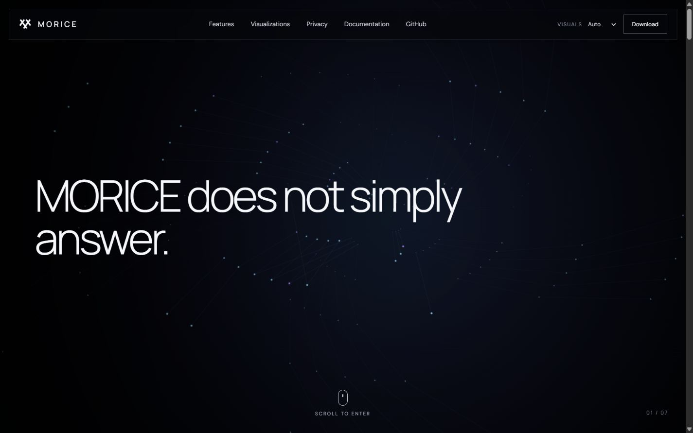
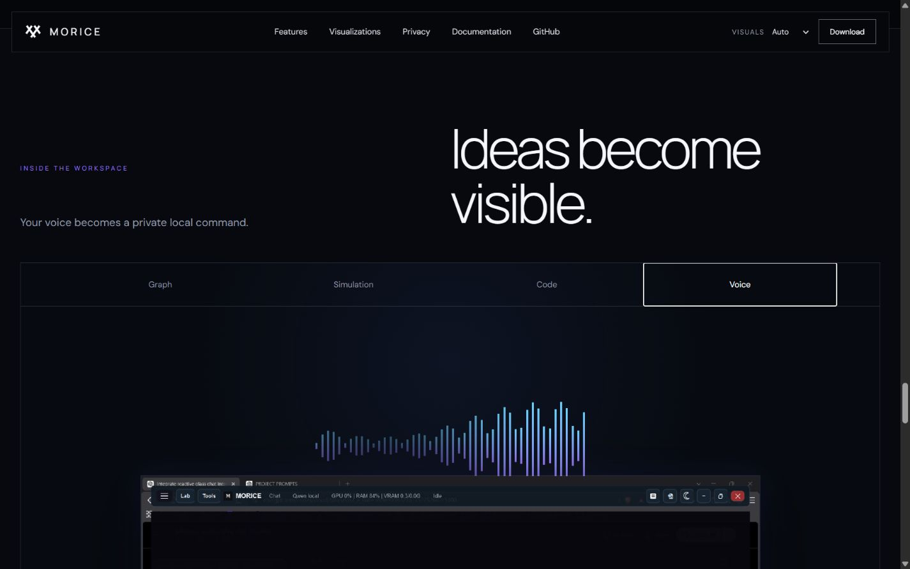
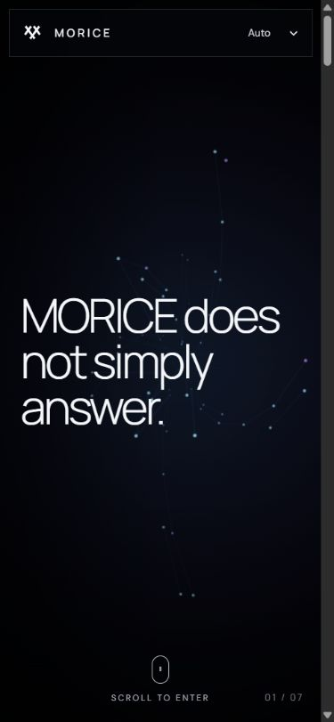

# MORICE website

The cinematic MORICE product site is a React + TypeScript application built with Vite and deployed to GitHub Pages by the repository workflow.

## Screenshots

| Desktop hero | Visualization workspace | Mobile hero |
| --- | --- | --- |
|  |  |  |

## Development

```bash
cd website
npm install
npm run dev
```

Production checks:

```bash
npm run typecheck
npm run build
npm run preview
```

## Architecture

- `src/App.tsx` owns the page sections, scroll-synchronized statement sequence, feature rail, interactive visualization modes, privacy comparison, and download calls to action.
- `src/NeuralCanvas.tsx` renders the procedural neural environment and AI core. It selects high, medium, or low detail based on viewport size, device memory, and reduced-motion preference. The header lets visitors override the automatic choice.
- `src/useScrollProgress.ts` maps native page scrolling to a reversible 0–1 hero timeline. There is no scroll hijacking.
- `src/styles.css` contains the design tokens, responsive layouts, canvas fallback background, transitions, and reduced-motion behavior.
- `public/` contains optimized copies of existing MORICE brand/product imagery.

## Editing the story

Change `statements` in `src/App.tsx` to replace the cinematic text sequence. The hero automatically divides the scroll timeline evenly between statements. Edit `features` and `showcase` in the same file to change the product content.

To replace the procedural scene, update `NeuralCanvas.tsx`; keep the canvas fixed inside `.hero-sticky` and derive every visual state from the `progress` prop so scrolling remains reversible.

## Accessibility and mobile fallback

The page uses native scrolling, semantic sections, keyboard-focusable navigation and controls, a skip link, descriptive image text, and visible focus behavior. `prefers-reduced-motion` collapses the long cinematic sequence to a static final frame and disables decorative animation. Small screens receive fewer canvas particles, a simplified core, compact navigation, and single-column content instead of a scaled-down desktop layout.

## Deployment

`.github/workflows/pages.yml` installs from `website/package-lock.json`, builds `website/dist`, and deploys that artifact with the official GitHub Pages actions. In the GitHub repository, set **Settings → Pages → Build and deployment → Source** to **GitHub Actions** if it is not selected already.
